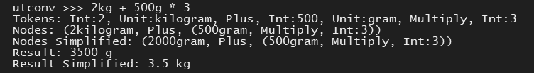

Simple tool for converting between units, with respect for order of operations. Writing in free time for fun, do not expect full blown professional tool for enginners.
  
`python shell.py`

## Features  
 - Supports all Si units, time (min, hour, day, year), temperature (fahrenheit, celsius), power (watt, amp, volt), etc.
 - Converting between Si suffixes (1kg = 1000g)
 - Correct order of operations, respecting parenthesis

## Planned
 - Converting between units (1A * 1V = 1W)
 - Complex units (km/h)
 - Simplifying units (kg\*m/s^2 to N)
 - Add power operator
 - Non decimal numbers (0xFFF, #FFFFFF, 0b1111)
 - Preprocessor for special characters (² -> ^2)
 - Postprocessor for cleaning up (f.eg. change Megagrams to Tonnes)
 - Add documentation
 - Add more units